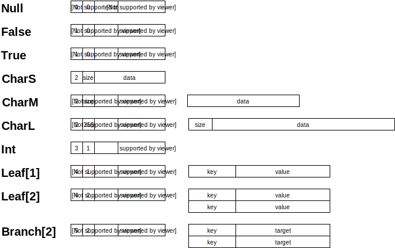

# db.d
Fast and compact immutable graph database

## Key features of MVP (coming soon)

* **Fast data add.** "Write Ahead Log" and two-step commits isn't requres.
* **Compact store.** Reserving memory for inplace data changing isn't required.
* **Fast lookup.** We have direct links between records and record local small indexes.
* **Easy API.** We have same REST API over HTTP and WebSockets.
* **[ACID](https://en.wikipedia.org/wiki/ACID).** Every commit is atomic. 
* **Fast restart.** Restore database at start after an unexpected server shutdown isn't required. Only file trim.

## Future features

* **Multy step transaction support!**
* **Data updates subscribing!**
* **SQL support?**
* **Automatic replication!**
* **Configurable partitioning!**
* **Integrated map-reduce!**
* **Ports to other languages?**
* **Administration user interface!**
* **Full-text indexes!**
* **Spatial indexes!**
* **Schema support?**
* **Triggers support?**
* **ACL support!**
* **Drivers for most popular languages!**

## Internals

